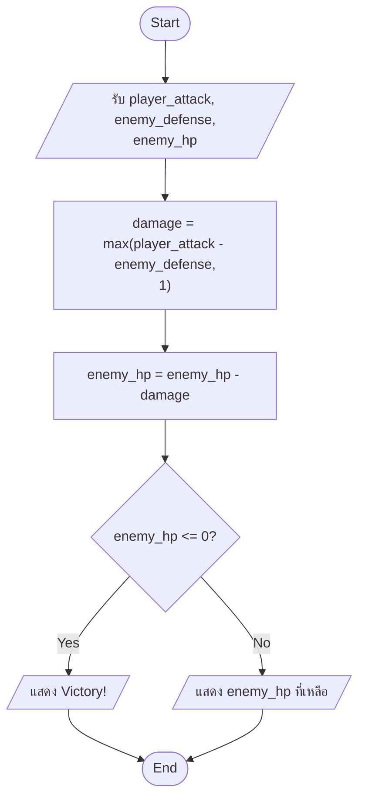
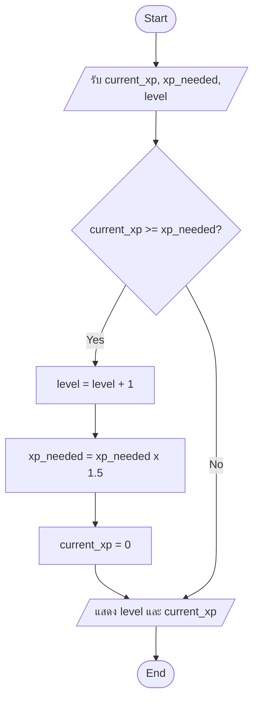

```mermaid
flowchart TD
Start([Start]) --> Input[/รับ player_attack, enemy_defense,
enemy_hp/]
Input --> Calc["damage = max(player_attack - enemy_defense,
1)"]
Calc --> Reduce["enemy_hp = enemy_hp - damage"]
Reduce --> D1{enemy_hp <= 0?}
D1 -->|Yes| Win[/แสดง Victory!/]
D1 -->|No| Show[/แสดง enemy_hp ที่เหลือ/]
Win & Show --> End([End])
```

```mermaid
flowchart TD
Start([Start]) --> Input[/รับ current_xp, xp_needed,
level/]
--> D1{current_xp >= xp_needed?}
D1 -->|Yes| a[level = level + 1]
a --> c[xp_needed = xp_needed x 1.5]
c --> d[current_xp = 0] --> b[/แสดง level และ current_xp/]
D1 -->|No| b[/แสดง level และ current_xp/]
b --> End([End])
```
