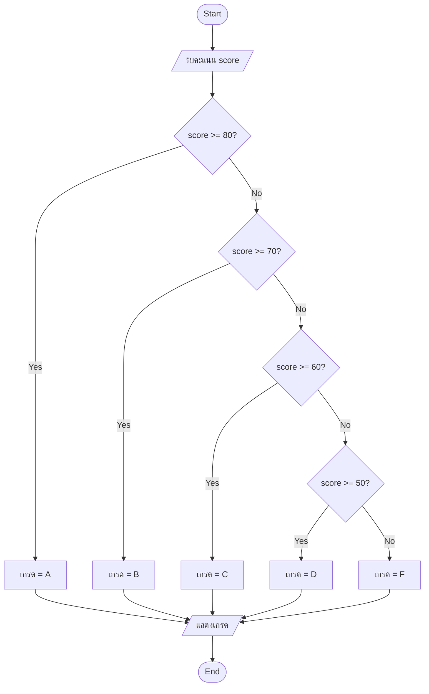
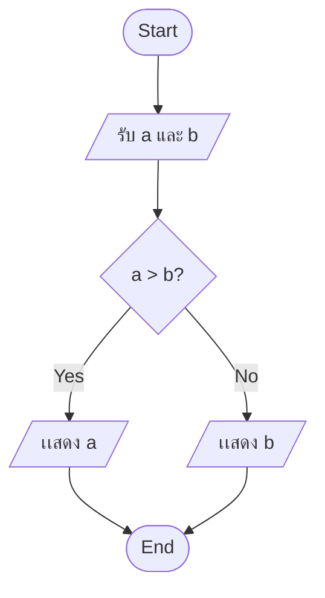
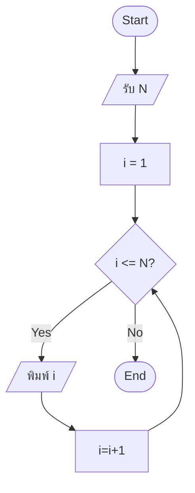

```mermaid
flowchart TD
Start([Start]) --> Input[/รับคะแนน score/]
Input --> D1{score >= 80?}
D1 -->|Yes| A[เกรด = A]
D1 -->|No| D2{score >= 70?}
D2 -->|Yes| B[เกรด = B]
D2 -->|No| D3{score >= 60?}
D3 -->|Yes| C[เกรด = C]
D3 -->|No| D4{score >= 50?}
D4 -->|Yes| D[เกรด = D]
D4 -->|No| F[เกรด = F]
A & B & C & D & F --> Output[/แสดงเกรด/]
Output --> End([End])
```

```mermaid
flowchart
Start([Start]) --> Input[/รับ a และ b/]
Input --> D1{a > b?}
D1 -->|Yes| a[/เเสดง a/]
D1 -->|No| b[/เเสดง b/]
a & b
--> End([End])
```

```mermaid
flowchart
Start([Start]) --> Input[/รับ N/]
Input --> D1[i = 1]
--> D{i <= N?}
D -->|Yes| a[/พิมพ์ i/]
D -->|No| b([End])
a --> B[i=i+1] --> D
```
